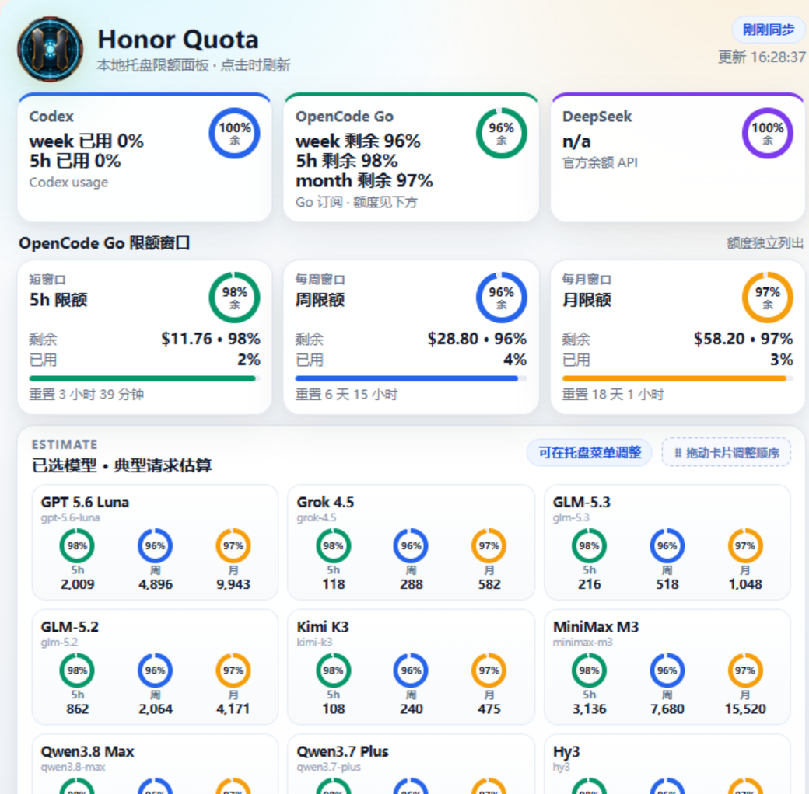
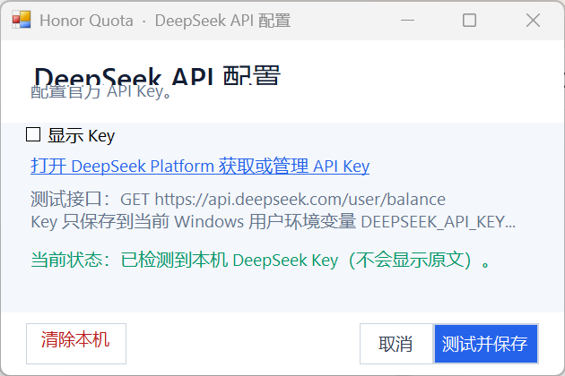
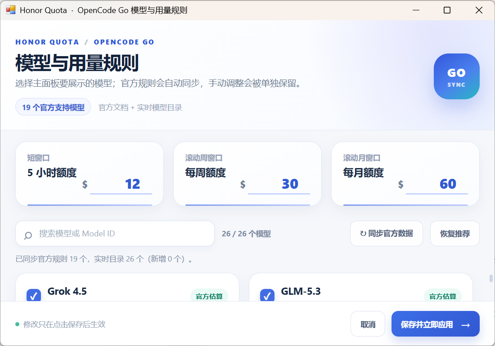

# Honor Quota

Honor Quota 是一个运行在 Windows 托盘区的本地额度面板，用来集中查看 Codex、OpenCode Go 和 DeepSeek。它把服务状态、OpenCode Go 额度窗口、模型请求估算和个人模型排序放在一个轻量桌面工具里。

[English README](README.md) · [下载发布包](https://github.com/wupeng0601/Honor-quota/releases) · [OpenCode Go 官方文档](https://opencode.ai/docs/zh-cn/go) · [DeepSeek 余额 API](https://api-docs.deepseek.com/zh-cn/api/get-user-balance/)

## 1. 这个程序能做什么

- 展示 Codex 的 5 小时和每周用量。
- 展示 OpenCode Go 的 5 小时、每周和每月额度窗口。
- 通过 DeepSeek 官方 `GET /user/balance` 接口展示余额。
- 根据 OpenCode Go 官方文档和实时模型目录同步模型。
- 自由选择显示哪些模型，修改典型请求估算，并拖动模型卡片排序。
- 完全本机运行，以托盘菜单为主，没有 Honor Quota 云端后台。

发布包不需要 Python。`src/honor_quota_cli.py` 只作为开发者可选的诊断工具保留。

## 2. 重要：三个服务分别是怎么读取的

三个服务提供额度数据的方式不同：

| 服务 | 发布包的正常读取方式 | 你需要提供什么 |
| --- | --- | --- |
| Codex | 读取本机 Codex 登录文件，再请求 Codex 用量接口。 | 正常完成一次本机 Codex 登录 |
| OpenCode Go | 使用内置 WebView2 登录会话读取 Go 面板，并写入本地缓存。 | 在 `OpenCode Go 登录/检查` 中完成 OpenCode Go 登录 |
| DeepSeek | 使用你提供的 API Key 请求官方余额接口。 | 在 `DeepSeek API 配置...` 中配置 DeepSeek API Key |

### OpenCode Go 不是只填 API Key

正常主面板路径使用 Honor Quota 自己的 WebView2 用户数据目录。登录窗口是真实的 OpenCode 网页会话，数据保存在当前用户的 `HonorQuota\WebView2` 下；它不是写死账号密码，也不会静默读取 Chrome 的 Cookie。

登录成功后，程序读取页面中的 `滚动用量`、`每周用量`、`每月用量`，并将结果写入 `opencode_go_cache.json`。`OPENCODE_GO_API_KEY` / `OPENCODE_API_KEY` 只保留给可选诊断 CLI 和模型访问检查使用。能请求模型目录，不代表一定能读取订阅额度。

### DeepSeek 必须显式配置官方 API

DeepSeek 没有 Codex 那样可以由 Honor Quota 安全发现的本地登录额度文件。因此托盘菜单里提供了明确的 `DeepSeek API 配置...` 窗口：输入 Key 后先请求官方余额接口测试，成功后保存到当前 Windows 用户的 `DEEPSEEK_API_KEY` 环境变量。Key 不会写入仓库或应用日志。

## 3. 运行要求

- Windows 10 或 Windows 11，x64。
- Microsoft Edge WebView2 Runtime。安装器会检查 Evergreen Runtime，缺少时尝试在线安装官方版本；离线电脑可能需要先安装 [WebView2 Standalone Runtime](https://developer.microsoft.com/microsoft-edge/webview2/)。
- 如果要读 Codex，需要正常完成 Codex 登录。
- 如果要读 OpenCode Go 订阅窗口，需要完成 OpenCode Go 登录。
- 如果要显示 DeepSeek 余额，需要 DeepSeek API Key。

发布包不要求 Python。

## 4. 安装和启动

1. 从 [Releases](https://github.com/wupeng0601/Honor-quota/releases) 下载 `HonorQuota-*-win-x64.zip`。
2. 解压到普通可写目录。
3. 在解压目录运行 `install-honor-quota.ps1`。如果 PowerShell 阻止脚本，运行：

   ```powershell
   powershell -ExecutionPolicy Bypass -File .\install-honor-quota.ps1
   ```

4. 从开始菜单启动 `Honor Quota`，也可以运行 `start-honor-quota.ps1`。
5. 左键点击托盘图标打开面板并刷新；右键点击托盘图标打开完整菜单。

程序默认按用户安装到 `%LOCALAPPDATA%\HonorQuota`。程序本身是按用户安装；WebView2 安装器仍可能需要联网或 Windows 权限提升。升级时会保留模型选择、拖拽顺序、缓存和历史。



_当前界面：顶部默认优先显示周额度，下方分开显示 5 小时、每周、每月窗口，估算区还会提示模型卡片可以拖动排序。_

## 5. 第一次配置三个服务

### 5.1 Codex

1. 先通过正常的 Codex 应用或 CLI 登录。
2. 确认 `%CODEX_HOME%\auth.json` 存在。如果没有设置 `CODEX_HOME`，默认位置是 `%USERPROFILE%\.codex\auth.json`。
3. 打开托盘菜单，选择 `显示并刷新`。

Honor Quota 不要求你把 Codex token 粘贴进面板。如果 Codex 失败，先检查 Codex 本身是否登录成功。不要把 `auth.json` 上传到 Issue。

### 5.2 OpenCode Go

1. 右键点击托盘图标。
2. 选择 `OpenCode Go 登录/检查`。
3. 在弹出的窗口中完成 OpenCode Go 登录。
4. 保持登录状态；窗口可以关闭，然后选择 `显示并刷新`。

这个 WebView2 登录会话与 Chrome 或 Edge 相互独立。如果后续显示 `OCG 无缓存`、`缓存时间未知` 或没有额度窗口，请再次打开 `OpenCode Go 登录/检查`，在该窗口中重新登录。

### 5.3 DeepSeek 官方 API

1. 在 [DeepSeek Platform](https://platform.deepseek.com/api-docs) 创建或复制 API Key。
2. 右键点击托盘图标，选择 `DeepSeek API 配置...`。
3. 将 Key 粘贴到隐藏显示的 `API Key` 输入框，需要时可以勾选 `显示 Key`。
4. 点击 `测试并保存`。
5. 等待窗口提示官方余额接口测试成功；窗口会关闭，Honor Quota 随后刷新面板。

程序测试的是：

```text
GET https://api.deepseek.com/user/balance
Authorization: Bearer <你的 Key>
```

官方返回 `is_available` 和 `balance_infos`，货币可能是 CNY 或 USD。这是 API 余额，不是 OpenCode Go 订阅额度。要删除 Key，重新打开同一窗口并点击 `清除本机 Key`。



_当前窗口：Key 默认隐藏，明确展示官方余额接口，并提供测试保存与清除入口。_

为兼容旧配置，程序也会读取 `DEEPSEEK_KEY`；正常界面使用标准的 `DEEPSEEK_API_KEY` 保存。

## 6. 如何看主面板

### 顶部三张摘要卡

- **Codex**：默认优先显示每周用量，下面显示 5 小时用量；如果 Codex 账号提供，会显示 `Reset credits`。
- **OpenCode Go**：默认优先显示每周剩余百分比，同时显示 5 小时和每月剩余百分比。
- **DeepSeek**：显示官方 API 返回的余额，通常是 CNY。

### OpenCode Go 三张额度卡

- **5h 窗口**：短窗口用量和下次重置时间。
- **每周窗口**：顶部默认优先展示的窗口和下次重置时间。
- **每月窗口**：长期窗口和下次重置时间。

圆环和进度条表示剩余百分比。`剩余` 是剩余美元金额，`已用` 是已使用百分比。这些是服务端额度窗口，不是保证还能发送多少条请求。

### 模型估算区

估算区回答的是“按典型请求计算，当前剩余额度大概还能支持多少请求”。它根据每个模型配置的 5 小时、每周、每月典型请求数换算，不是服务商账单计量。提示词长度、输出长度、工具调用、推理过程以及服务端规则变化都会影响实际结果。

## 7. 模型目录、规则和拖拽排序

从托盘菜单打开 `OpenCode Go 模型与用量规则...`。



_当前编辑器：官方目录同步、搜索、额度窗口、模型勾选和保存应用入口集中在同一个窗口。_

### 选择显示哪些模型

- 用模型显示名或 Model ID 搜索。
- 勾选模型，让它出现在主面板估算区。
- 取消勾选可以隐藏模型，但不会删除它的规则。

### 获取新模型

当 OpenCode Go 发布新模型时，点击 `刷新官方模型目录`。Honor Quota 会合并官方 Go 文档和实时模型目录。实时目录已经出现、但官方尚未给出估算规则的模型会标记为 **待配置**，不会擅自猜一个数字。

### 修改估算规则

顶部的 5 小时、每周、每月数值是用于换算的 OpenCode Go 美元窗口。每个模型都有对应的典型请求估算。只有在有可靠文档或实测依据时才建议修改，修改后点击 `保存并立即应用`。

手动覆盖值和启用状态会单独保留，后续刷新官方目录不会悄悄覆盖你的选择。

### 拖动主面板卡片

主面板的模型卡片可以直接拖动。把卡片拖到新位置并松开，顺序会保存到 `opencode_go_models.json`。拖动只改变展示顺序，不改变服务访问或额度计算。

## 8. 托盘操作和本地文件

| 托盘操作 | 作用 |
| --- | --- |
| `显示并刷新` | 打开面板并刷新服务数据 |
| `静默刷新` | 在后台刷新，不打开面板 |
| `开机启动` | 开关当前用户的开机启动 |
| `OpenCode Go 登录/检查` | 打开独立的 WebView2 登录会话 |
| `OpenCode Go 模型与用量规则...` | 选择模型、修改估算、刷新目录 |
| `DeepSeek API 配置...` | 测试、保存或清除 DeepSeek 官方 API Key |
| `打开程序目录` | 打开本地程序目录 |

重要运行文件：

| 文件或目录 | 作用 |
| --- | --- |
| `opencode_go_models.json` | 模型选择、拖拽顺序和手动估算覆盖 |
| `opencode_go_cache.json` | WebView2 会话读取的 OpenCode Go 用量缓存 |
| `usage_history.json` | 本地面板历史记录 |
| `honor-quota-app.log` | 本地诊断日志 |
| `%LOCALAPPDATA%\HonorQuota\WebView2` | OpenCode Go 登录/会话数据 |

请保持这些文件私密，它们可能包含 workspace ID、余额、账号标识、时间信息和会话相关数据。

## 9. 按现象排查

| 现象 | 处理方式 |
| --- | --- |
| 启动后没有面板 | 查看系统托盘隐藏区域，再从安装目录重新运行 `HonorQuota.exe`。 |
| `WebView2 初始化失败` | 安装或修复 [Microsoft Edge WebView2 Runtime](https://developer.microsoft.com/microsoft-edge/webview2/)，然后重启。 |
| Codex 不可用 | 先完成 Codex 正常登录，确认 `auth.json` 存在。 |
| OpenCode Go 有模型但没有额度 | 使用 `OpenCode Go 登录/检查`；API Key/模型访问本身不足以读取订阅窗口。 |
| OpenCode Go 显示没有缓存 | 在 Honor Quota 自己的 WebView2 窗口重新登录，再点击 `显示并刷新`。 |
| DeepSeek 提示缺少 Key | 打开 `DeepSeek API 配置...`，粘贴 Key 并点击 `测试并保存`。 |
| DeepSeek 测试返回 401 | Key 无效或已失效，请在 DeepSeek Platform 创建新的 Key。 |
| DeepSeek 测试返回 402 | 官方账户余额不足。 |
| 找不到新模型 | 刷新官方模型目录，并按 Model ID 搜索。 |
| 模型显示待配置 | 实时目录已发现模型，但官方尚未发布估算规则。 |
| 估算和实际用量不同 | 估算是典型请求换算，不是服务商账单记录。 |
| 设置无法保存 | 使用默认用户目录，便携目录不要直接放在 `C:\Program Files`。 |

## 10. 隐私和安全

- Honor Quota 没有云端后台。
- 服务请求只发往服务商或程序使用的官方模型目录接口。
- 不要提交或公开 `auth.json`、API Key、缓存和日志。
- 公开发布包不包含你的个人凭据或运行时缓存。
- DeepSeek 界面会把 Key 保存到当前 Windows 用户环境变量，程序重启后可以继续使用；不再需要时请从同一窗口清除。

## 11. 从源码构建

程序是 .NET Framework WinForms/WebView2 应用。PowerShell 构建脚本会下载固定版本的 Microsoft WebView2 NuGet 包，并调用系统 C# 编译器：

```powershell
powershell -ExecutionPolicy Bypass -File .\scripts\build.ps1
```

构建结果写入 `build\HonorQuota`，发布 ZIP 写入 `dist\`。构建和运行发布包都不需要 Python。可选诊断 CLI 位于 [`src/honor_quota_cli.py`](src/honor_quota_cli.py)。

## 许可证和声明

Honor Quota 源码采用 MIT License。Microsoft WebView2 程序集和运行时组件仍受 Microsoft 条款约束。服务名称、接口和 logo 归各自权利人所有。详见 [LICENSE](LICENSE) 和 [SECURITY.md](SECURITY.md)。

本项目是独立的本地工具，与 OpenAI、OpenCode、DeepSeek、Microsoft 或 HONOR 没有隶属关系。
